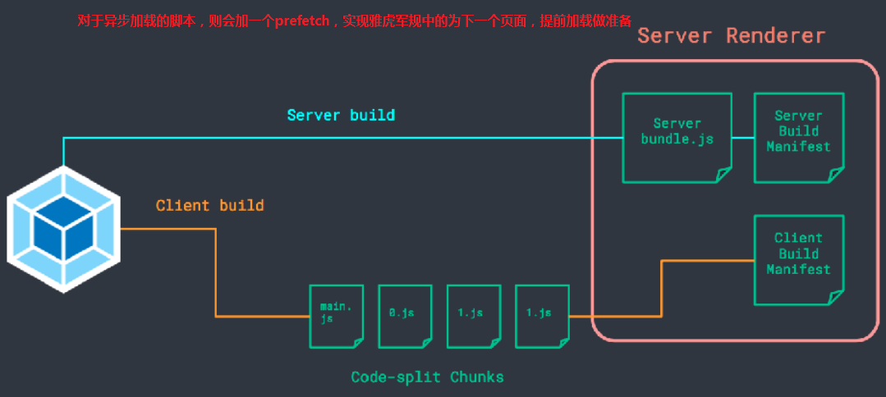

# VUE源码分析
## MVVM
> MVVM并不是VUE创建的，很早的时候**微软**就有了**Silverlight**
> IE9以下不支持VUE，是因为浏览器不支持Object.defineProperty，而这是vue核心利用的技术
> 如果想要向下兼容，则需要使用 vbscript


## Vue架构概览


## 双向数据绑定
> 涉及技术
> > Object.defineProperty: 设置对象的get和set方法
> > Observer: 订阅模式
> > Watcher: 观察者
> > Dep: 连接Watcher和Observer的依赖
> > Directive: 指令，例如: v-text="hello"


### 模拟源码流程 src
> - 1.全局创建一个vue实例(类)
> - 2.实例挂载属性 data {text:'hello'}
> - 3.observe 遍历了data对象，进行拆分
> - 4.定义一个相关函数(vue实例对象, text, 'hello world')
> - 5.Object.defineProperty将data数据进行 set和get
> - 6.Dep 连接watcher和observer的依赖
> - > text -> dep.addSub(Dep.target)收集依赖，观察者
> - 7.Dep 就是一个队列，实现了观察者模式
> - 8.Dep.target: 读到html {{text}} -> Dep.target -> watcher 
> - 9.Compile(app节点,vue的实例对象)将app节点内容转换成文档片段，拿回html，编译指令，插回到dom,并创建一个watcher
> - 10.setState -> virtual dom-diff -> batch update dom


```bash
--------------html---------------------
1.全局创建一个vue实例
<div id="app">
  <input type="text" id="a" v-model="text">
  {{text}}
</div>
<script>
    var vm = new Vue({
      el: 'app',
      data: {
        text: 'hello world'
      }
    });
</script>

----------------MVVM------------------------
function Vue(options) {
    2.实例挂载属性 data: {text:'hello'}
    this.data = options.data;
    var data = this.data;
    3.observe 遍历了data对象，进行拆分
    observe(data, this);
    var id = options.el;
9.Compile(app节点,vue的实例对象)将app节点内容转换成文档片段，拿回html，编译指令，插回到dom,并创建一个watcher
    var dom =new Compile(document.getElementById(id),this);
    // 编译完成后，将dom返回到app中
    document.getElementById(id).appendChild(dom);
}

-----------------Observe--------------------
/**
 * obj: {text:'hello'}
 * vm: vue实例
 */
function observe(obj, vm) {
  //遍历
  Object.keys(obj).forEach(function(key) {
    //拆分
    defineReactive(vm, key, obj[key]);
  })
}
4.定义一个相关函数(vue实例对象, text, 'hello world')
/**
 * obj: vue实例
 * key: text
 * val: 'hello'
 */
function defineReactive(vm, key, val) {
  var dep = new Dep();
  5.Object.defineProperty将data数据进行 set和get
  Object.defineProperty(vm, key, {
    get: function() {
      6.添加观察者watcher到主题对象Dep
      if (Dep.target) {
        //JS的浏览器单线程特性，保证这个全局变量在同一时间内，只会有同一个监听器使用
        dep.addSub(Dep.target);
      }
      return val;
    },
    set: function(newVal) {
      //如果set的值与原来的值相同则返回
      if (newVal === val) return;
      //不同则由dep来notify发通知给watcher
      val = newVal;
      console.log(val);
      6.作为发布者发出通知
      dep.notify();
    }
  })
}

-------------------Dep----------------------
7.Dep 就是发布者，subs就是收集来的订阅者（就是一个个watcher），很好的实现了观察者模式
function Dep() {
  this.subs = [];
}
Dep.prototype = {
  addSub: function(sub) {
    this.subs.push(sub);
  },
  notify: function() {
    this.subs.forEach(function(sub) {
      sub.update();
    })
  }
}

----------------Watcher--------------------
//8.
function Watcher(vm, node, name, type) {
    Dep.target = this;
    this.name = name;
    this.node = node;
    this.vm = vm;
    this.type = type;
    this.update();
    Dep.target = null;
}
Watcher.prototype = {
    update: function() {
        this.get();
        //10.批量更新
        var batcher = new Batcher();
        batcher.push(this);
        // this.node[this.type] = this.value; // 订阅者执行相应操作
        // this.cb();
    },
    cb:function(){
        this.node[this.type] = this.value; // 订阅者执行相应操作
    },
    // 获取data的属性值
    get: function() {
        this.value = this.vm[this.name]; //触发相应属性的get
    }
}

--------------------Compile----------------------
Compile(app节点,vue的实例对象)将app节点内容转换成文档片段，拿回html，编译指令，插回到dom,并创建一个watcher
//此处代码比较多，简写一下
function Compile(node, vm) {
  if (node) {
    this.$frag = this.nodeToFragment(node, vm);
    return this.$frag;
  }
}
Compile.prototype = {
  nodeToFragment: function(node, vm) {
    var self = this;
    var frag = document.createDocumentFragment();//创建DOM片段
    var child;

    while (child = node.firstChild) {
      self.compileElement(child, vm);
      frag.append(child); // 将所有子节点添加到fragment中
    }
    return frag;
  },
  compileElement: function(node, vm) {
    var reg = /\{\{(.*)\}\}/;
    //节点类型为元素
    if (node.nodeType === 1) {
      var attr = node.attributes;
      // 解析属性
      for (var i = 0; i < attr.length; i++) {
        if (attr[i].nodeName == 'v-model') {
          var name = attr[i].nodeValue; // 获取v-model绑定的属性名
          node.addEventListener('input', function(e) {
            // 给相应的data属性赋值，进而触发该属性的set方法
            vm[name] = e.target.value;
          });
          // node.value = vm[name]; // 将data的值赋给该node
          new Watcher(vm, node, name, 'value');
        }
      };
    }
    //节点类型为文本节点或span
    if (node.nodeType === 3) {
      if (reg.test(node.nodeValue)) {
        var name = RegExp.$1; // 获取匹配到的字符串
        name = name.trim();
        // node.nodeValue = vm[name]; // 将data的值赋给该node
        new Watcher(vm, node, name, 'nodeValue');
      }
    }
  },
}
```

### Vitrual DOM
> 为什么说DOM操作是昂贵的?
> >一个元素带的东西(属性)太多了，而且涉及到重绘重排，操作DOM性能地狱啊
> > 可以document.createDocumentFragment


> 为什么要使用virtual-dom？
> > dom diff -> 最小化的局部更新
> > virtual-dom是一系列模块集合，用来提供声明式DOM渲染，本质上是在JS和DOM之间做一个缓存，JS只操作虚拟DOM，最后再把变更写入DOM

> dom-diff
> > 深度遍历，同层比较
> > 

### 批量更新
*要想理解上面第10步中的批量更新，我们先要明白V8引擎的Event Loop概念*
> 浏览器的几种队列
> - 主线程:也叫同步队列
> - 宏队列:异步队列 macrotask
> - > ajax 事件绑定 setTimeout/setInterval
> - 微队列: microtask
> - > promise Object.observe(将要废掉) MutationObserver(用来取代Object.observe)


## VUE运行时优化
> 1.对于不变的内容，标记出来，不做dom-diff

> 2.对于数据不变的内容，直接生成，不做dom-diff


> 3.SSR采用直出字符串拼接的方式，根本不需要dom-diff

> 4.SSR异步加载脚本

> 5.SSR对CSS的优化:将css都转化为原子CSS(VUE3.0可能会出来)


## VUE3.0展望
> 当我们使用VUE2.0发现一个问题，vm.data = 123，无效果，是因为没有经过watcher这一步，只能通过全局的一些方法比如vm.$set 来使用watcher
> VUE3.0会去掉DEP，Watcher，Observer这一坨东西，为什么这么说呢，VUE3.0将利用ES6的proxy代理和Reflect反射来实现双向绑定，监听，那么流程图就应该是这样了


### proxy
> - Proxy 可以理解成，在目标对象之前架设一层“拦截”，外界对该对象的访问，都必须先通过这层拦截，因此提供了一种机制，可以对外界的访问进行过滤和改写,可以译为“代理器”
> - Proxy可以监听对象本身的变化，并在变化后执行相应的操作。可以实现追踪对象，同时在数据绑定方面也很有用处 
> - var proxy = new Proxy(target, handler);
> - new Proxy()表示生成一个Proxy实例，target参数表示所要拦截的目标对象，handler参数也是一个对象，用来定制拦截行为
> - 注意，要使得Proxy起作用，必须针对Proxy实例（上例是proxy对象）进行操作，而不是针对目标对象进行操作
```

//定义被侦听的目标对象
var target = { name: 'Joe Sixpack', salary: 50 };
//定义处理程序
var handler = {
    construct (target, args, newTarget) {
        return new target(...args);
    }
    set: function (receiver, property, value) {
        //receiver：target
        console.log(property, 'is changed to', value);
        receiver[property] = value;//更改target对象
    },
    get: function(target, property){
        if(property in target){
            return target[property];
        }else{
            throw new ReferenceError('Property \'' + property + '\' does not exist.');
        }
    },
    apply: function(){
        return 'I am the proxy';
    }
};
//创建代理以进行侦听
var proxy = new Proxy(target, handler);
//做一些改动来触发代理
proxy.salary = 60;//控制台输出：salary is changed to 60
console.log(target);// {name: "Joe Sixpack", salary: 60}
proxy.name = 'Rose';
console.log(target);// {name: "Rose", salary: 60}
```

### Reflect 
> Reflect对象与Proxy对象一样，也是 ES6 为了操作对象而提供的新 API
> 1.将Object对象的一些明显属于语言内部的方法（比如Object.defineProperty），放到Reflect对象上。现阶段，某些方法同时在Object和Reflect对象上部署，未来的新方法将只部署在Reflect对象上。也就是说，从Reflect对象上可以拿到语言内部的方法
> 2.修改某些Object方法的返回结果，让其变得更合理。比如，Object.defineProperty(obj, name, desc)在无法定义属性时，会抛出一个错误，而Reflect.defineProperty(obj, name, desc)则会返回false
> 3.让Object操作都变成函数行为。某些Object操作是命令式，比如name in obj和delete obj[name]，而Reflect.has(obj, name)和Reflect.deleteProperty(obj, name)让它们变成了函数行为
> 4.Reflect对象的方法与Proxy对象的方法一一对应，只要是Proxy对象的方法，就能在Reflect对象上找到对应的方法。这就让Proxy对象可以方便地调用对应的Reflect方法，完成默认行为，作为修改行为的基础。也就是说，不管Proxy怎么修改默认行为，你总可以在Reflect上获取默认行为。

```
// 老写法
target[property] = attributes;

try {
  Object.defineProperty(target, property, attributes);
  // success
} catch (e) {
  // failure
}

// 新写法
if (Reflect.defineProperty(target, property, attributes)) {
  // success
} else {
  // failure
}

// 老写法
'assign' in Object // true
// 新写法
Reflect.has(Object, 'assign') // true

Proxy(target, {
  set: function(target, name, value, receiver) {
    var success = Reflect.set(target,name, value, receiver);
    if (success) {
      log('property ' + name + ' on ' + target + ' set to ' + value);
    }
    return success;
  }
});
```

